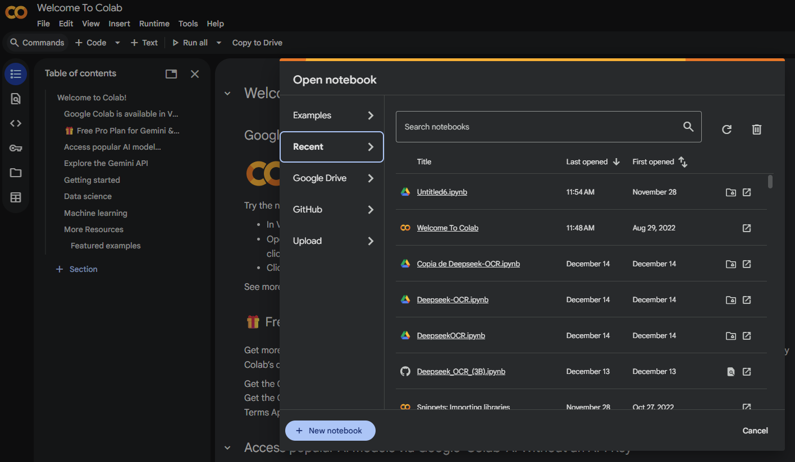

# Setup Environment

There are several options for package management in Python. Regardless of which one you
choose, **my recommendation is to always opt for the simplest and most minimalist
alternative**. The fewer the number of dependencies and the lighter the project, the
easier it will be to take it to production (for example, in a Docker image), share it
with your team, or maintain it over time.

Currently, the options I most recommend are **Poetry** and **uv**. Both tools streamline
the creation and management of environments, allow you to maintain project configurations
in an organized way through a pyproject.toml file and, above all, promote project
reproducibility, which is essential both in development and deployment.

## Development Environment Configuration

Setting up the development environment is the first step to ensure organized,
reproducible, and technically sound work. In this context, a Python virtual environment
is created using **uv**, ensuring that the Python version used matches exactly what is
specified in the project's `pyproject.toml` file. This file acts as the single source of
truth for project configuration, including the interpreter version and required
dependencies.

The virtual environment is created using the `uv venv` command, which initializes an
isolated environment without requiring additional configurations. Once created, the
environment is activated so that all subsequent operations, such as package installation
or code execution, are restricted to that context. This isolation helps avoid conflicts
between different projects and ensures that dependencies do not interfere with those
installed globally on the system.

The use of **uv** is especially relevant in this context. It is one of the most recent
and efficient tools for managing environments and dependencies in Python, developed by
Astral, the same team responsible for Ruff. Its main strength lies in its performance, as
it is implemented in Rust, which allows it to install and resolve dependencies in
milliseconds. Additionally, it adopts a configuration model inspired by Cargo, the
package manager from the Rust ecosystem, using the `pyproject.toml` file as the central
axis of the project.

## Conceptual Comparison between _venv_ and _uv_

In the Python ecosystem, there are multiple tools for creating and managing virtual
environments, which can be confusing at first glance. To understand this diversity, it is
useful to conceptually compare the traditional approach based on **venv** with the modern
proposal introduced by **uv**, analyzing their differences from a practical and technical
perspective.

When creating an environment with **venv**, you use a tool included in Python's standard
library whose sole purpose is to generate an isolated virtual environment. This
environment contains a copy of the interpreter and basic libraries, but does not offer
integrated mechanisms for advanced dependency management. In contrast, **uv** allows you
to create another virtual environment in a similar way, but does so as part of a
comprehensive solution that unifies environment creation, dependency resolution, and
installation, all supported by the `pyproject.toml` file.

The comparison between both tools can be summarized in the following conceptual table:

| Criterion             | venv                                                                       | uv                                                                     |
| --------------------- | -------------------------------------------------------------------------- | ---------------------------------------------------------------------- |
| Speed                 | Adequate, but dependent on external tools like pip to install dependencies | Very high, with dependency resolution and installation in milliseconds |
| Ease of use           | Simple for creating environments, but requires combining several tools     | Fluid and coherent, with a single workflow                             |
| Generated files       | Virtual environment directory without project metadata                     | Virtual environment and centralized management via `pyproject.toml`    |
| Dependency management | Not integrated, depends on pip and files like `requirements.txt`           | Integrated and reproducible from `pyproject.toml`                      |

This contrast highlights that the existence of multiple tools responds to the evolution
of Python development needs. While **venv** solves the basic problem of isolation, **uv**
simultaneously addresses speed, reproducibility, and workflow simplification.

Dependency reproducibility is a key aspect in modern projects. To guarantee it, a
`pyproject.toml` file is created in which project dependencies are explicitly defined
and, when appropriate, constraints on the Python version. This file becomes the formal
specification of the environment needed to run the project correctly.

Once dependencies are defined, the existing virtual environment is completely removed.
Next, the environment is recreated from scratch using **uv**, which reads the contents of
`pyproject.toml`, resolves dependencies, and automatically installs them in the new
environment. This process demonstrates practically that the project can be faithfully
reproduced on another machine or system, as long as the same configuration file is
available.

In this way, the use of **uv** not only simplifies the technical management of the
environment, but also reinforces fundamental principles of software development such as
portability, reproducibility, and reliability of the execution environment.

## Environment Configuration in Google Colab

Google Colab provides a cloud-based execution environment that allows you to experiment
and develop Python code without the need for local installations, which is especially
useful for computationally intensive tasks and machine learning. The process begins by
opening a Notebook in Google Colab, which offers a fully functional Python environment by
default.

Once the notebook is created, GPU usage is activated from the runtime environment
configuration. This action enables access to hardware accelerators provided by Google's
infrastructure, allowing computationally demanding operations to run significantly more
efficiently than on a conventional CPU.

To verify that the GPU is correctly enabled and available, the `!nvidia-smi` command is
executed. This command queries the status of the graphics card assigned to the
environment and displays relevant information such as the GPU model, available memory,
and current resource usage. Identifying the specific GPU model is essential, as
performance can vary notably between different architectures.

With the GPU properly configured, a comparison of execution times between CPU and GPU is
performed using a large-scale matrix operation, for example, multiplication of dense
matrices. This practical test allows you to directly observe how the same computational
task presents substantial differences in execution time depending on the hardware used.
On the CPU, the calculation is performed sequentially or with limited parallelism, while
on the GPU, massive parallelism is leveraged to process thousands of operations
simultaneously.

The objective of this exercise is to understand the real impact of hardware on intensive
computational tasks. Beyond theory, the empirical comparison between CPU and GPU
demonstrates why graphics accelerators have become a key component in areas such as deep
learning, numerical simulation, and large-scale data analysis. This understanding is
essential for making informed decisions about the most appropriate infrastructure based
on the type of problem to be solved.

## Installing Dependencies

Installing dependencies is a central process in any Python project, as it determines
which external libraries will be available and under which versions the code will run.
The main public package repository for Python is **PyPI** (_Python Package Index_),
accessible at [https://pypi.org/](https://pypi.org/), where tens of thousands of
libraries are published and maintained.

PyPI acts as a global catalog containing both the source code and metadata associated
with each package, including available versions, required dependencies, compatibility
with different Python versions, and basic documentation. This repository allows
dependency management tools to automatically locate, download, and install the libraries
needed for a given project.

In a modern workflow, dependency installation is not conceived as an isolated action, but
as part of a declarative project configuration. Instead of installing packages manually
and ad hoc, dependencies are explicitly defined in a configuration file, usually within
the `pyproject.toml` file. This file indicates which packages are required and under what
conditions, and management tools, such as `uv`, are responsible for resolving the
appropriate versions by querying PyPI.

This approach provides several fundamental advantages. First, it guarantees consistency
between different development environments, since all are built from the same
specification. Second, it improves reproducibility, allowing the complete environment to
be recreated on another machine without ambiguity. Finally, it reduces issues arising
from version incompatibilities by centralizing and automating dependency resolution.
